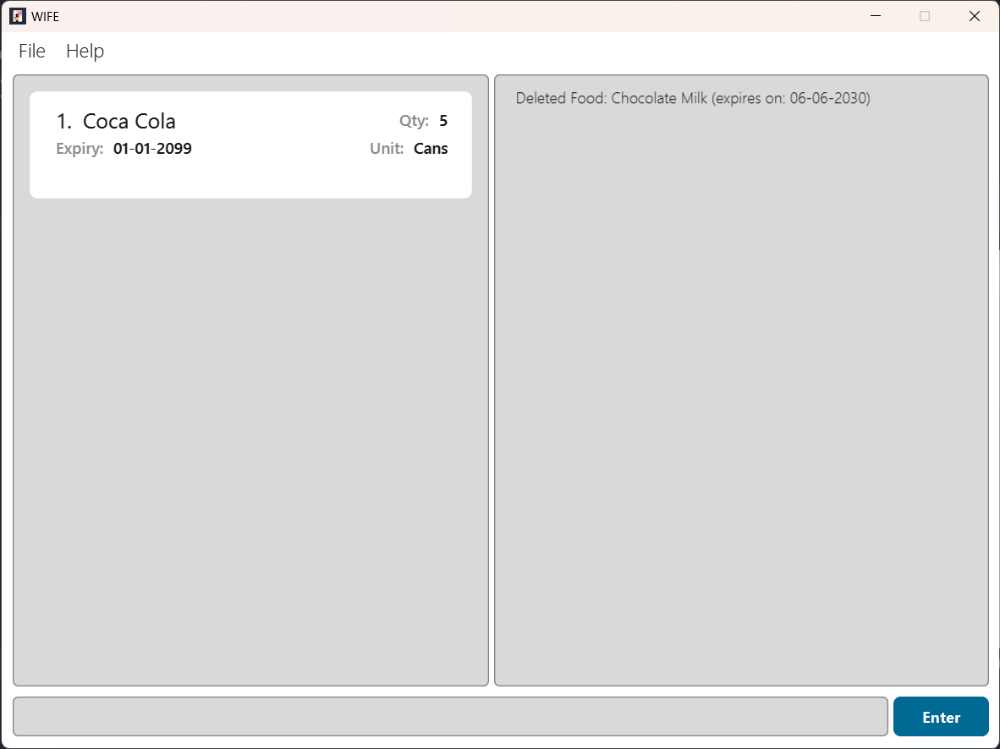
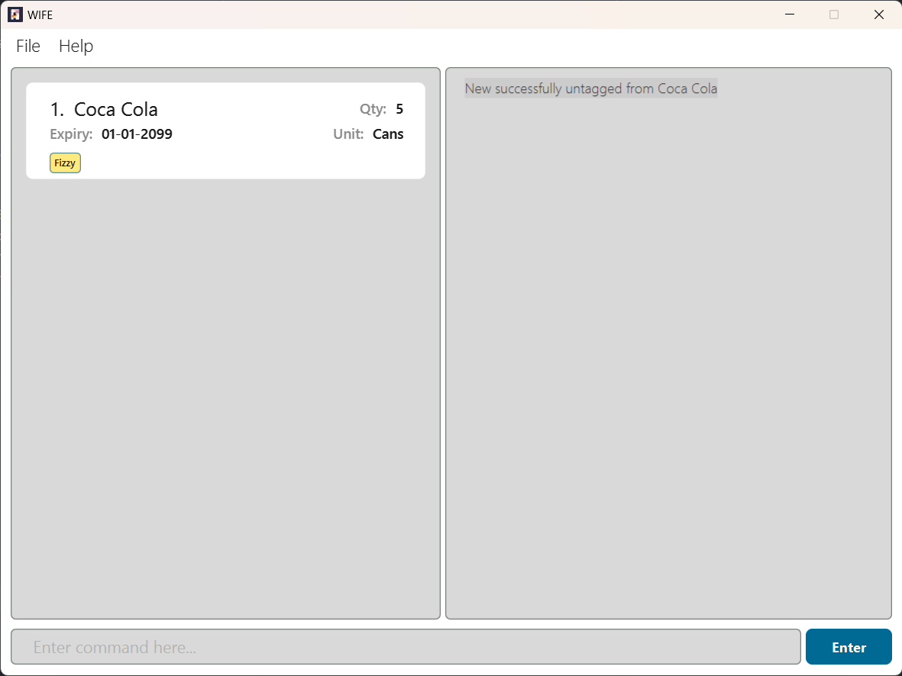

USER GUIDE FOR WIFE
---
Enhance life with WIFE! Our product Well Informed Fridge Environment &lt;WIFE/&gt; helps users to manage 
their food items in the fridge, and never question her. With this, one never have to worry about
optimizing storage and organization of food items in a refrigerator, thereby reducing waste and 
improving the efficiency of grocery shopping.

* Table of Contents <br/>
*(coming soon...)*

--------------------------------------------------------------------------------------------------------------------

## Quick start

1. Ensure you have Java `11` or above installed in your Computer.

2. Download the latest `wife.jar` from [here](https://github.com/AY2223S2-CS2103T-T11-1/tp/releases/tag/v1.3(trial)).

3. Copy the file to the folder you want to use as the _home folder_ for your WIFE.

4. Open a command terminal, `cd` into the folder you put the jar file in, and use the `java -jar wife.jar` command to run the application.<br>
   A GUI similar to the below should appear in a few seconds.<br>
   

5. Type the command in the command box and press Enter to execute it. e.g. typing **`help`** and pressing Enter will open the help window.<br>
   Some example commands you can try:

    *WIP*

1. Refer to the [Features](#features) below for details of each command.

--------------------------------------------------------------------------------------------------------------------

## Features

<div markdown="block" class="alert alert-info">

**:information_source: Notes about the command format:**<br>

* Words in `UPPER_CASE` are the parameters to be supplied by the user.<br>
  e.g. in `add n/NAME`, `NAME` is a parameter which can be used as `add n/Meiji Milk`.

  * Items in square brackets are optional.<br>
    e.g `inc INDEX [q/QUANTITY]` can be used as `inc 1 q/10` or as `inc 1`.

* Items with `…`​ after them can be used multiple times including zero times.<br>
  e.g. `[t/TAG]…​` can be used as ` ` (i.e. 0 times), `t/Vegetables`, `t/Fresh` etc.

* Parameters can be in any order.<br>
  e.g. if the command specifies `n/NAME u/UNIT`, `u/UNIT n/NAME` is also acceptable.

* If a parameter is expected only once in the command but you specified it multiple times, only the last occurrence of the parameter will be taken.<br>
  e.g. if you specify `n/item1 n/item2`, only `n/item2` will be taken.

* Extraneous parameters for commands that do not take in parameters (such as `list`, `exit` and `clear`) will be ignored.<br>
  e.g. if the command specifies `list 123`, it will be interpreted as `help`.

</div>

### Getting help: `help`

Dynamic helps functionality provides general help as well as command specific help that includes command formats and example usages.

Format: `help [COMMAND_NAME]` where `COMMAND_NAME` may be omitted to view general help

##### List of COMMAND_NAME
- Food Commands:
  * add
  * delete
  * delbytag
  * edit
  * inc
  * dec
  * find
  * inc
  * list
  * listbytag
  * view

- Tag Commands:
  * tag
  * untag
  * createtag
  * deltag
  * listtag

- General Commands:
  * clear
  * exit
  * help


Example 1:
`help` displays a general help message
```
Type 'help COMMAND' to see specific help for a command.
Commands Available: add, delete, edit, find, list, view, tag, clear, exit

For more information refer to the user guide: https://ay2223s2-cs2103t-t11-1.github.io/tp/UserGuide.html
```
Example 2:
`help add` displays the command format and example usages specific to the `add` command
```
Add food item - add n/NAME u/UNIT q/QUANTITY e/EXPIRY DATE [t/TAG]...
Example Usage: add n/Broccoli u/STALK q/2 e/03-03-2033 t/VEGETABLES t/HEALTHY
```

## Food-related Commands

### Adding a food: `add`

Add a new food into your fridge.

Keyword: `add`

Examples:
* `add n/Meiji Milk u/carton q/2 e/13-11-2025`

Result: <br/>
`add n/Meiji Milk u/carton q/2 e/13-11-2025` displays


### Listing all food items : `list`

Shows a list of all food item in WIFE.

Format: `list`

Example:

`list` returns
```shell
  listed all food
```

### Editing a food item : `edit`

Edit food items in your fridge.
Format: `edit INDEX [n/NAME] [u/UNIT] [q/QUANTITY] [e/EXPIRY DATE] [t/TAG]...`

* Index must be a valid integer that refers to an an item currently in the fridge

Example: <br/>
`edit 1 n/Broccoli q/2` returns
```markdown
Edited food item: Broccoli (expires on: 03-03-2033)
```

### Increasing a quantity of a food item : `inc`

Increases the quantity of a Food item in WIFE.

Format: `inc INDEX [q/QUANTITY]`

* Increases the quantity of the food item at the specified `INDEX`.
* The index refers to the index number shown in the displayed food item list.
* The index **must be a positive integer** 1, 2, 3, …​
* If no quantity is specified, the default quantity to increase is 1.
* If a quantity is specified, it **must be a positive integer** 1, 2, 3, …​

Examples:

`inc 1` returns
```markdown
  Increased Food: Broccoli (expires on: 03-03-2033) by 1
```
`inc 1 q/100` returns

```markdown
  Increased Food: Broccoli (expires on: 03-03-2033) by 100
```

### Decreasing the quantity of a food item : `dec`
Decreases the quantity of a Food item in WIFE.
Format: `dec INDEX [q/QUANTITY]`

Usage is the same as `inc`, with the only difference is being to decrease the quantity of the Food item.

### Deleting a food item : `delete`

Deletes the specified food item from WIFE.

Format: `delete INDEX`

* Deletes the food item at the specified `INDEX`.
* The index refers to the index number shown in the displayed food item list.
* The index **must be a positive integer** 1, 2, 3, …​

Result:

`delete 1` returns
```shell
Deleted Food: Meiji Milk (expires on 13-11-2025)
```



## Tag-related Commands

### Create a new tag: `createtag`

Creates a new pre-defined tag in WIFE.

Format: `createtag n/<tag Name>`
- Creates new `Tag` with `Tag Name`

Example:
`createtag n/dairy` displays
```
Tag(s) successfully created:
Dairy
```

### Tagging a food item: `tag`

Tag the specified food item in your fridge with our pre-defined tags.

Pre-Defined Tags:
- Status - `USED`, `UNUSED`
- Categories - `MEAT`, `DAIRY`, `VEGETABLES`

Format: `tag <Index> n/ <Tag Name>`
- Tag the food item of index `Index` with `Tag Name`
- Index refers to any number on the food item list and must be a positive number, i.e., 1, 2, 3, 4, …

Example: <br/>
`tag 1 n/dairy` returns


### Untagging a food item: `untag`

Remove a tag from a specified food item in your fridge.

Format: `untag <index> n/<tag name>`
- Remove `Tag Name` from the food item with index `Index`
- Index refers to any number on the food item list and must be a positive number, i.e., 1, 2, 3, 4, …

Example:
`untag 1 n/vegetables` displays



UntagFood

### Listing your tags: `listtag`

List all the tags that you have created.

Format: `listtag`

Example:
`listtag` displays
```
Here are your existing tags: 
Dairy
Meat
Vegetables
```

### Listing all food items by their tag(s) : `listbytag`
Shows a list of all food item in WIFE by specified tag(s).

Format: `listbytag n/TAG NAME...`

Example:

`listbytag n/Vegetables n/Healthy` returns

```shell
Listed all food with the following tags:
[Vegetables]
[Healthy]
```

### Deleting a food item by their tag(s) : `delbytag`

Deletes food item from WIFE by specified tag(s).

Format: `delbytag n/TAG NAME...`

Examples:

`delbytag n/Healthy n/Dairy` returns
```shell
Deleted Food:
Broccoli (expires on: 03-03-2033)
Meiji Milk (expires on: 03-03-2033)
```

### Deleting tag(s) : `deltag`

Deletes specified defined tags from WIFE. It also removes all the tags that are tagged on the food item, if any.

Format: `deltag n/TAG NAME...`

Examples:

`deltag n/Healthy n/Dairy` returns
```shell
Tag successfully deleted:
[Dairy]
[Healthy]
```

## General Commands

### Exiting the program : `exit`

Exits the program.

Format: `exit`

### Saving the data

*To be included in future iterations*

### Editing the data file

Wife data are saved as a JSON file `(file name placeholder)`. Advanced users are welcome to update data directly by editing that data file.

<div markdown="span" class="alert alert-warning">:exclamation: **Caution:**
If your changes to the data file makes its format invalid, WIFE will discard all data and start with an empty data file at the next run.
</div>

### Archiving data files `[coming in v2.0]`

_Details coming soon ..._

--------------------------------------------------------------------------------------------------------------------

## FAQ

**Q**: Can I use this application with other people? <br/>
**A**: As of now, WIFE does not support concurrent users. If you would like to share your WIFE food list with another
user, install WIFE on their computer and overwrite their data file with the data file created by WIFE in your computer.

**Q**: Can I use WIFE on mobile devices? <br/>
**A**: As of now, WIFE is designed to only run on computers and laptops due to the usage of the Command Line Interface.
There is no support for mobile devices yet.

**Q**: Do I need to connect to wifi to use WIFE? <br/>
**A**: No, you can use WIFE without a wifi connection.

--------------------------------------------------------------------------------------------------------------------

## Command summary

*coming soon...(table of commands summary)*
