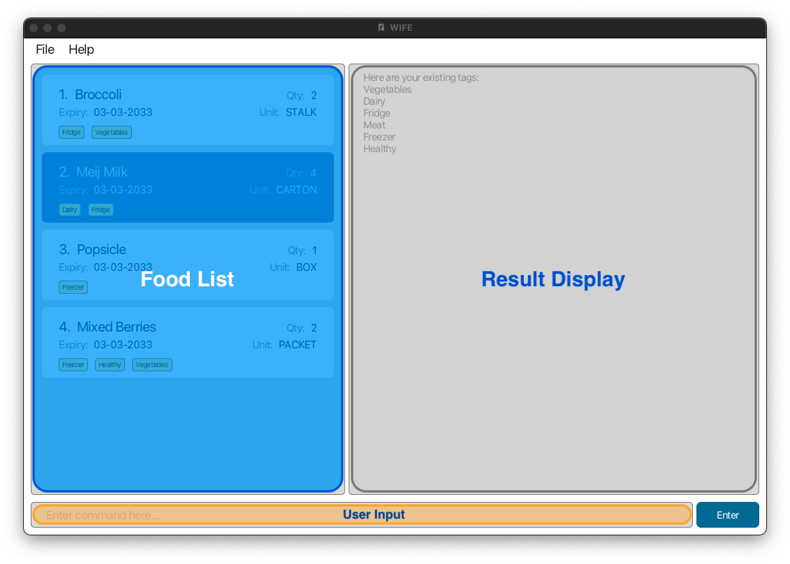
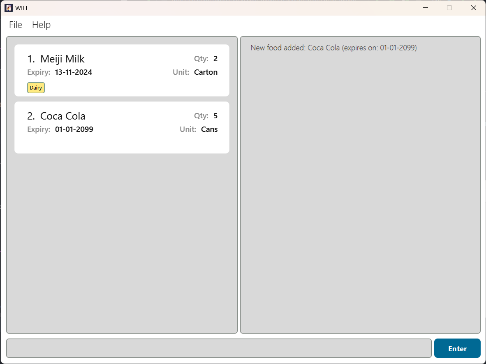
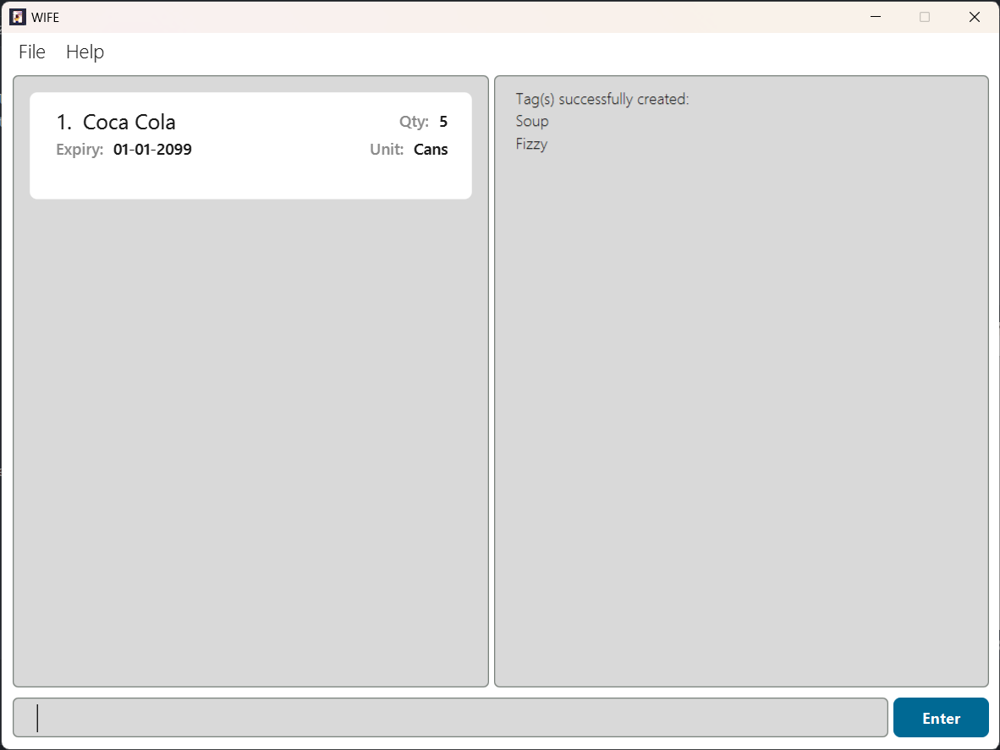

USER GUIDE FOR WIFE
---
Enhance life with WIFE! Our product Well Informed Fridge Environment &lt;WIFE/&gt; helps users to manage their
items in the fridge. With this, one never has to worry about optimizing storage and organization of food items in their
refrigerator!

--------------------------------------------------------------------------------------------------------------------
## Table of Contents
  * [Quick Start](#quick-start)
  * [Trying out your first command](#trying-out-your-first-command)
  * [Features](#features)
    * [Food-related features](#food-related-features)
      * [Add a food](#add-a-food-add)
      * [List all food](#list-all-food-items-list)
      * [Edit a food](#edit-a-food-edit)
      * [Find a food](#find-a-food-find)
      * [Increase the quantity of a food](#increasing-the-quantity-of-a-food-inc)
      * [Decrease the quantity of a food](#decreasing-the-quantity-of-a-food-dec)
      * [Delete a food](#delete-a-food-delete)
      * [Sort food by expiry date](#checking-expiry-of-food-items--expiry)
    * [Tag-related features](#tag-related-features)
      * [Create a tag](#create-a-new-tag-createtag)
      * [Tag a food](#tag-a-food-tag)
      * [Untag a food](#untag-a-food-untag)
      * [List all tags](#list-all-tags-listtag)
      * [Listing all foods by their tags](#listing-all-foods-by-their-tags--listbytag)
      * [Delete foods by their tags](#delete-foods-by-their-tags--delbytag)
      * [Delete tags](#delete-tags--deltag)
    * [General features](#general-features)
      * [Getting Help](#getting-help-help)
      * [Clearing WIFE](#clearing-wife--clear)
      * [Exit the program](#exit-the-program--exit)
  * [Saving the data](#saving-the-data)
  * [Editing the data file](#editing-the-data-file)
  * [FAQ](#faq)
  * [Command Summary](#command-summary)
    * [Food Commands](#food-commands)
    * [Tag Commands](#tag-commands)
    * [General Commands](#general-commands)
  * [Glossary](#glossary)

--------------------------------------------------------------------------------------------------------------------
## Quick start

1. Ensure you have [`Java 11`](https://www.oracle.com/sg/java/technologies/javase/jdk11-archive-downloads.html) or above installed in your Computer.

2. Download the latest `wife.jar` from [here](https://github.com/AY2223S2-CS2103T-T11-1/tp/releases).

3. Double-click on the application to run WIFE!

<div markdown="block" class="alert alert-info">

If double-clicking the application does not work:
  * Copy the file to the folder you want to use as the _home folder_ for your WIFE.
  * Open a command terminal, `cd` into the folder you put the jar file in, and use the `java -jar wife.jar` command to run the application.<br>

</div>


A GUI similar to the below should appear in a few seconds.
   
The main application consists of 3 components, namely:
* Food List
* Result Display
* User Input Box

--------------------------------------------------------------------------------------------------------------------
## Trying out your first command!
Not sure how to start? Don't worry, let's start out with a simple command as an example using the sample data
provided WIFE when you first start up. 

* Type the following command in the user input box at the bottom of WIFE and press 'Enter' on your keyboard
to execute it.
  
  `add n/Coca Cola u/Cans q/5 e/01-01-2099`

You should see your food list be updated as such!

  
Congratulations, you just added your first item!

To see what the command format means, you can refer to the [Features](#features) below for details of each command to maximise your productivity with WIFE.

--------------------------------------------------------------------------------------------------------------------
<div style="page-break-after: always;"></div>

## Features

<div markdown="block" class="alert alert-info">

**:information_source: Notes about the command format:**<br>

* Words in `UPPER_CASE` are the parameters to be supplied by the user.<br>
  e.g. in `add n/NAME`, `NAME` is a parameter which can be used as `add n/Meiji Milk`.

  * Items in square brackets are optional.<br>
    e.g `inc INDEX [q/QUANTITY]` can be used as `inc 1 q/10` or as `inc 1`.

* Items with `…`​ after them can be used multiple times including zero times.<br>
  e.g. `[t/TAG NAME]…​` can be used as ` ` (i.e. 0 times), `t/Vegetables`, `t/Fresh` etc.

* Parameters can be in any order.<br>
  e.g. if the command specifies `n/NAME u/UNIT`, `u/UNIT n/NAME` is also acceptable.

* If a parameter is expected only once in the command but you specified it multiple times, only the last occurrence of the parameter will be taken.<br>
  e.g. if you specify `n/item1 n/item2`, only `n/item2` will be taken.

* Extraneous parameters for commands that do not take in parameters (such as `list`, `exit` and `clear`) will be ignored.<br>
  e.g. if the command specifies `list 123`, it will be interpreted as `list`.

</div>


## Food-related Features

### Add a food: `add`
Add a new food into WIFE. (This is the command when you tried out your first command!)

Format: `add n/NAME u/UNIT q/QUANTITY e/EXPIRY DATE`
Note:
* All parameters must be present in the command. Date must be in the format of DD-MM-YYYY.
* `UNIT` of the food item must have at most 10 characters.
* `QUANTITY` of the food item **must be a positive integer** 1, 2, 3, …​
* `QUANTITY` of the food item should be less than `1,000,000`.
* `EXPIRY DATE` of the food item should be in the format `DD-MM-YYYY`. Examples of valid date format:
  * 11-11-2025
  * 07-04-2024
* `EXPIRY DATE` of the new food should not be before the date of insertion.

Example:

`add n/Coca Cola u/Cans q/5 e/01-01-2099` returns
```markdown
New food added: Coca Cola (expires on: 01-01-2099)
```



### List all food items: `list`

Shows a list of all food item in WIFE.

Format: `list`

Example:

`list` returns
```shell
  Listed all food items!
```

### Edit a food: `edit`

Edit food items in WIFE.

Format: `edit INDEX [n/NAME] [u/UNIT] [q/QUANTITY] [e/EXPIRY DATE]`

Note:
* `INDEX` must be a valid integer that refers to an item currently in the fridge.
* `QUANTITY` of the food item should be less than `1,000,000`.
* `EXPIRY DATE` of the food item should be in the format `DD-MM-YYYY`. Examples of valid date format:
  * 11-11-2025
  * 07-04-2024
* `EXPIRY DATE` of the edited food should not be before the date of insertion.

Example: <br/>
`edit 1 n/Cauliflower q/20` returns
```markdown
Edited food item: Cauliflower (expires on: 03-04-2033)
```

### Find a food: `find`

Find food items in WIFE which names contain any of the specified keywords. Keywords are case-insensitive.

Format: `find KEYWORD [KEYWORD]...`

Example: <br/>
`find Broccoli` returns
```markdown
1 food item(s) found!
```

### Increasing the quantity of a food: `inc`

Increases the quantity of a food item in WIFE.

Format: `inc INDEX [q/QUANTITY]`

Note:
* Increases the quantity of the food item at the specified `INDEX`.
* The `INDEX` refers to the index number shown in the displayed food item list.
* The `INDEX` **must be a positive integer** 1, 2, 3, …​
* If no `QUANTITY` is specified, the default `QUANTITY` to increase is 1.
* If a `QUANTITY` is specified, it **must be a positive integer** 1, 2, 3, …​

Examples:

`inc 2` returns
```markdown
  Increased Food: Kai Lan (expires on: 03-03-2033) by 1
```


`inc 1 q/100` returns

```markdown
  Increased Food: Kai Lan (expires on: 03-03-2033) by 100
```

### Decreasing the quantity of a food: `dec`

Decreases the quantity of a food item in WIFE.

Format: `dec INDEX [q/QUANTITY]`

Usage is the same as `inc`, with the only difference is being to decrease the quantity of the Food item.

Note:
* The `QUANTITY` specified to decrease by **cannot be equal to or greater than** the current quantity of the food item.
If you wish to delete the item, please use the `delete` command!

### Delete a food: `delete`

Deletes the specified food item from WIFE.

Format: `delete INDEX`

Note:
* Deletes the food item at the specified `INDEX`.
* The `INDEX` refers to the index number shown in the displayed food item list.
* The `INDEX` **must be a positive integer** 1, 2, 3, …​

Result:

`delete 3` returns
```markdown
Deleted Food: MEIJI MILK (expires on 05-04-2023)
```


### Checking expiry of food items : `expiry`

Sorts the food items by expiry date in ascending order (food items with a closer expiry date will appear at the top)
and displays all food items.

Format: `expiry`

Examples:

`expiry` returns
```shell
Food items are being sorted by their expiry dates.
```

## Tag-related Features

### Create a new tag: `createtag`

Creates a new pre-defined tag in WIFE.

Format: `createtag n/TAG NAME [n/TAG NAME]...`

Note:
* `TAG NAME` has a maximum limit of **15 characters**.
* `TAG NAME` is case-insensitive and two tags with the same name will be classified as duplicates.
* If in the case where any of the tags (but not all) already exists in WIFE, the non-duplicate tags will be created. 
  However, if all of the tags being declared already exist in WIFE, WIFE will return an error response to prevent 
  the creation of duplicate tags.

Example:
`createtag n/Stir Fry n/Soup` displays
```markdown
Tag(s) successfully created:
Stir Fry
Soup
```



### Tag a food: `tag`

Tag the specified food item in your fridge with our pre-defined tags.

Pre-Defined Tags:
* `New`
* `Used`
* `Dairy`

Format: `tag INDEX n/TAG NAME`

Note:
* Each food item can have a maximum of **4** tags.
* Only one tag can be tagged to a food item per command.
* `TAG NAME` must be a valid tag created in WIFE. List of tags available can easily be checked 
* using the [`listtag`](#list-all-tags-listtag) command.
* `INDEX` refers to any number on the food item list and must be a positive number, i.e., 1, 2, 3, 4, …

Example: <br/>
`tag 2 n/Stir Fry` returns
```markdown
Kai Lan successfully tagged with Stir Fry
```


### Untag a food: `untag`

Remove a tag from a specified food item in your fridge.

Format: `untag INDEX n/TAG NAME`
* Remove `TAG NAME` from the food item with index `INDEX`.
* `TAG NAME` must be an existing tag of the selected food item.
* Only one tag can be removed from a food item per command.
* `INDEX` refers to any number on the food item list and must be a positive number, i.e., 1, 2, 3, 4, …

Example:
`untag 2 n/Stir Fry` returns
```markdown
Stir Fry successfully untagged from Kai Lan
```


### List all tags: `listtag`

List all the tags that you have created, including the pre-defined tags.

Format: `listtag`

Example:
`listtag` displays
```
Here are your existing tags: 
Dairy
Meat
Vegetables
```

### Listing all foods by their tag(s) : `listbytag`
Shows a list of all food item in WIFE by specified tag(s).
Food items that contains any tags specified in the command will be listed.

Format: `listbytag n/TAG NAME [n/TAG NAME]...`

Example:

`listbytag n/Vegetables n/Healthy` returns

```markdown
Listed all food with the following tags:
[Vegetables]
[Healthy]
```


### Delete foods by their tag(s) : `delbytag`

Delete food items from WIFE by their specified tag(s).

Format: `delbytag n/TAG NAME [n/TAG NAME]...`

Examples:

`delbytag n/Healthy n/Dairy` returns
```shell
Deleted Food:
Broccoli (expires on: 03-03-2033)
Meiji Milk (expires on: 03-03-2033)
```

### Delete tag(s) : `deltag`

Deletes specified tags from WIFE. This command will delete all occurrences of the specified tags that are
tagged to food items in the food list, if any.

Format: `deltag n/TAG NAME [n/TAG NAME]...`
* `TAG NAME` must match an existing tag in WIFE.

Examples:

`deltag n/Healthy n/Dairy` returns
```shell
Tag successfully deleted:
[Dairy]
[Healthy]
```

## General Features

### Getting help: `help`

The dynamic `help` functionality provides general help as well as command specific help that includes command formats and example usages.
It appears as a separate help window.

Format: `help [COMMAND_NAME]` where `COMMAND_NAME` may be omitted to view general help

##### List of COMMAND_NAME
- Food Commands:
  * add
  * list
  * edit
  * find
  * inc
  * dec
  * delete
  * expiry

- Tag Commands:
  * createtag
  * tag
  * untag
  * listtag
  * listbytag
  * delbytag
  * deltag

- General Commands:
  * help
  * clear
  * exit

Example 1:
`help` displays a general help message


Example 2:
`help add` displays the command format and example usages specific to the `add` command
```
Add food item - add n/NAME u/UNIT q/QUANTITY e/EXPIRY DATE
Example Usage: add n/Broccoli u/STALK q/2 e/03-03-2033
```

### Clearing WIFE : `clear`

Clears the entire food list in WIFE.

Format: `clear`

<div markdown="span" class="alert alert-warning">:exclamation: **Caution:**
This is a destructive command! Using this command will empty all food items and tags. Be careful when using this command!
</div>

### Exit the program : `exit`

Exits the program.

Format: `exit`

### Saving the data

Your data is automatically saved after any executed commands. But to be safe, we will suggest to always exit the application
by the `exit` command to prevent any corruption of the file.

### Editing the data file

Wife data are saved as a JSON file `wife.json` in the 'data' folder in the directory where `wife.jar` is in. Advanced
users are welcome to update data directly by editing that data file.

<div markdown="span" class="alert alert-warning">:exclamation: **Caution:**
If your changes to the data file makes its format invalid, WIFE will discard all data and start with an empty data file at the next run.
</div>

--------------------------------------------------------------------------------------------------------------------

## FAQ

**Q**: Can I use this application with other people? <br/>
**A**: As of now, WIFE does not support concurrent users. If you would like to share your WIFE food list with another
user, install WIFE on their computer and overwrite their data file with the data file created by WIFE in your computer.

**Q**: Can I use WIFE on mobile devices? <br/>
**A**: As of now, WIFE is designed to only run on computers and laptops due to the usage of the Command Line Interface.
There is no support for mobile devices yet.

**Q**: Do I need to connect to wifi to use WIFE? <br/>
**A**: No, you can use WIFE without a wifi connection.

--------------------------------------------------------------------------------------------------------------------
<div style="page-break-after: always;"></div>

## Command summary

### Food Commands

| Feature             | Action                                   | Command Format                                              | Example                                   |
|---------------------|------------------------------------------|-------------------------------------------------------------|-------------------------------------------|
| Add                 | Adds a food item to the food list        | `add n/NAME u/UNIT q/QUANTITY e/EXPIRY DATE`                | `add n/Coca Cola u/Cans q/5 e/01-01-2099` |
| List                | Lists all food items                     | `list`                                                      | `list`                                    |
| Edit                | Edits a food item                        | `edit INDEX [n/NAME] [u/UNIT] [q/QUANTITY] [e/EXPIRY DATE]` | `edit 1 n/Cauliflower q/20`               |
| Find                | Finds a food item                        | `find KEYWORD [KEYWORD]...`                                 | `find Broccoli`                           |
| Increase            | Increases the quantity of a food item    | `inc INDEX [q/QUANTITY]`                                    | `inc 1 q/100`                             |
| Decrease            | Decreases the quantity of a food item    | `dec INDEX [q/QUANTITY]`                                    | `dec 1 q/100`                             |
| Delete              | Deletes a food item                      | `delete INDEX`                                              | `delete 3`                                |
| Sort by expiry date | List all food items by their expiry date | `expiry`                                                    | `expiry`                                  |


### Tag Commands

| Feature            | Action                                        | Command Format                         | Example                            |
|--------------------|-----------------------------------------------|----------------------------------------|------------------------------------|
| Create Tag         | Creates a new pre-defined tag in WIFE         | `createtag n/TAG NAME [n/TAG NAME]...` | `createtag n/Dairy`                |
| Tag                | Tags a food item with a pre-defined tag <br/> | `tag INDEX n/TAG NAME`                 | `tag 3 n/Fresh`                    |
| Untag              | Removes a tag from a food item                | `untag INDEX n/TAG NAME`               | `untag 3 n/Fresh`                  |  
| List tags          | Lists all the tags created                    | `listtag`                              | `listtag`                          |
| List foods by tags | Lists all food items by specified tags        | `listbytag`                            | `listbytag n/Vegetables n/Healthy` |
| Delete by tags     | Deletes food items by their tags              | `delbytag n/TAG NAME [n/TAG NAME]...`  | `delbytag n/Healthy n/Dairy`       |
| Delete tags        | Deletes specified tags.                       | `deltag n/TAG NAME [n/TAG NAME]...`    | `deltag n/Healthy n/Dairy`         |


### General Commands

| Feature | Action                                                | Command Format | Example    |
|---------|-------------------------------------------------------|----------------|------------|
| Help    | Shows a help message                                  | `help`         | `help add` |
| Clear   | Resets all food items <br/>(**Destructive command!**) | `clear`        | `clear`    |
| Exit    | Exits WIFE                                            | `exit`         | `exit`     |


--------------------------------------------------------------------------------------------------------------------

## Glossary

* **GUI:** Graphical User Interface - It is the view of the application that you see!
* **Destructive Command:** It will wipe out all current data in WIFE.
